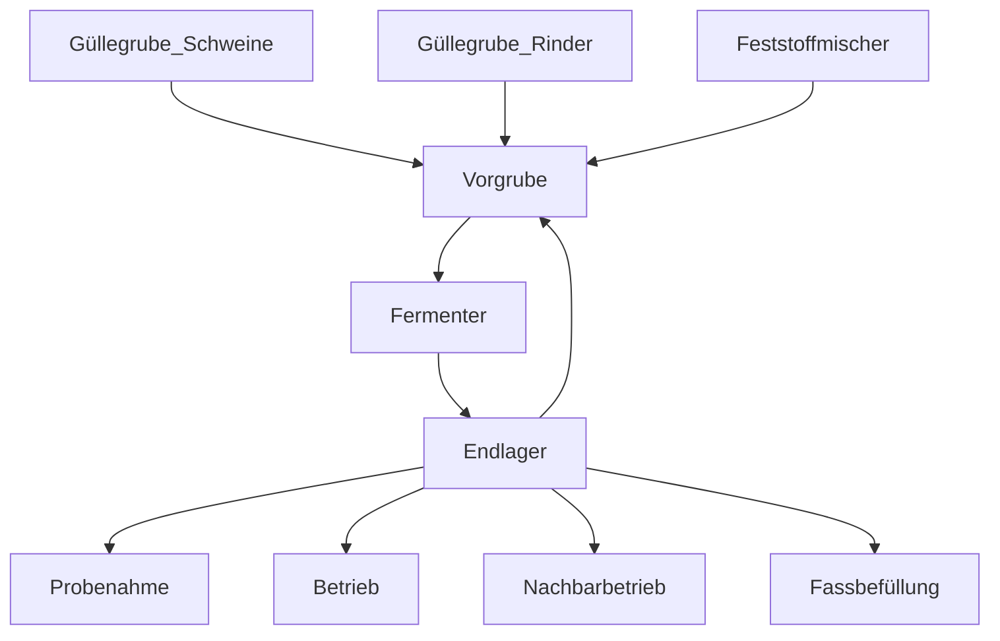

# BGA_Steuerung

## Übersicht:

Dieses Repository enthält Platine-Daten und Software zur Steuerung und Überwachung der Substratflüsse einer landwirtschaftlichen Biogasanlage. 

## Funktion:

### Biogasanlage allgemein:

Auf dem Landwirtschaftsbetrieb wird eine Biogasanalge des Types Haral-Energie geplant. Diese zeichnet sich durch den eckigen, unterirdischen Fermenter aus. Das gewonnene Gas wird in einem Blockheizkraftwerk verbrannt, wobei Wärme und im gekoppelten Generator Strom entsteht. Die Wärme wird für die Versorgung des Landwirtschaftsbetriebs genutzt, der Strom wird in das öffentliche Netz eingespiesen.
Die Anlage besteht aus einer Vorgrube (Mischen der Substrate), einem Fermenter (Methangaserzeugung) und einem Endlager.  Im nachfolgenden Diagramm wird die Funktionsweise der Anlage schematisch dargestellt:

Gasführende Anlagenteile werden durch diese Steuerung nicht beeinflusst. 
Für den Betrieb der gesamten Anlage sind mehrere Pumpen und Schieber sowie ein Motor für den Betrieb des Festsoffmischers nötig. Die meisten werden neu installiert und werden mit einer Schützsteuerung bedient. Für die bereits bestehende Pumpe, welche mit Funk bedient wird, wird ein stationäres Ergänzungsfunksendemodul installiert. Die Schieber werden pneumatisch gesteuert. Der Luftfluss wird mit 12v 5/2 Pneumatikventilen geregelt.

### Schnittstellen der Steuerungsplatine:

+ 24 Digitale Inputs für NPN-Sensoren (Signal aktiv wenn auf Masse gezogen)
+ 6 Analoge Inputs (Stromschleife 4-20mA)
+ 2 Analoge Inputs (0-5v)
+ 16 Digitale Outputs
+ UART, SPI, I2C, drahtlose Kommunikationsmöglichkeiten des Raspberry Pi 4
+ 
### Steuerung der Anlage: _Sequenzenhandling noch nicht programmiert!_

Das Programm lädt Sequenzen, die zu einem bestimmten Zeitpunkt abgespielt werden sollen. Der Benutzer ist frei in der Programmierung der Sequenzen. Diese werden in einer .txt-Datei gespeichert und bei allfälligem Neustart des Programms wieder aufgerufen. Für das Fortschreiten in der Sequenz können Wartezeiten, Messmengen aber auch Bedingungen wie Schieberstellungen (geprüft mit digitalen Inputs) dienen.

## Software

Das Programm läuft auf einem Raspberry Pi 4, welcher mittel I2C mit den IO-Expandern auf der Platine kommuniziert. Die Kommunikation übernimmt eine Klasseninstanz von HW_Con. Die grafische Darstellung übernimmt die Klasse GUI, für z.B.unterschiedliche Ebenen können mehrere Instanzen erzeugt werden. Für das Rendering wird SDL2 genutzt. Es wird auf eine Abstrahierung des Quellcodes geachtet, viele Positionen der Elemente auf dem Display können in der dazugehörigen .txt-Datei angepasst und in der Software während Laufzeit neu geladen werden.

## Weiteres
Verbesserungspotenzial:
+ GND Pins bei I2C und UART Terminals vergessen
+ Sicherheit der digitalen Outputs verbessern (z.B.: blockieren der Stromversorgung aller Relais bis zum Zeitpunkt der explizit gewünschten Freigabe
+ Schöneres Layout der Platine
+ Aufbauposition des Raspberry optimieren
+ Pin Header besser zu Montageposition des RPI anpassen
+ weiteres...
